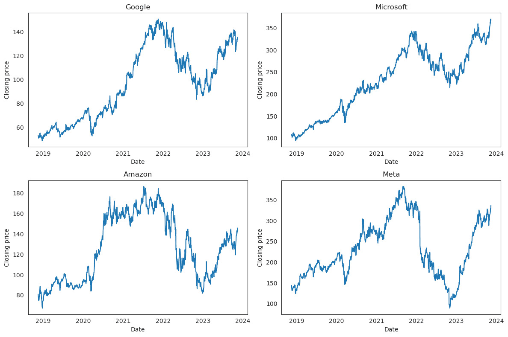
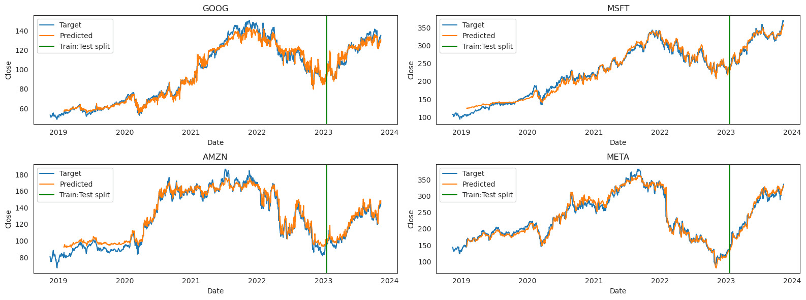
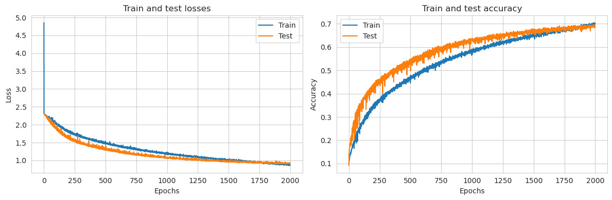

# ML Models

This repository contains PyTorch implementations of some machine learning models some of which I implemented as a form of practice while I was learning PyTorch.

List of models:
1. [LSTM](#lstm)
2. [CNN](#cnn)

## LSTM

### Model

LSTM model is implemented using PyTorch's built-in `torch.nn.LSTM` layer for LSTM cells.

Link to notebook: [lstm-stock-price.ipynb](./lstm/lstm-stock-price.ipynb)

```python
# Model config
input_size = 1
hidden_size = 32
num_layers = 2
num_classes = 1

# Create model
model = StockLSTM(input_size, hidden_size, num_layers, num_classes)

# Loss function
criterion = torch.nn.MSELoss()

# Optimizer
optimizer = torch.optim.Adam(model.parameters(), lr=0.0001) 

# Train model
train_model(model, optimizer, criterion, 6000, dataset, initial_epoch=5000)
```

**Model architecture**:
```
StockLSTM(
  (lstm): LSTM(1, 32, num_layers=2, batch_first=True)
  (fc_1): Linear(in_features=32, out_features=128, bias=True)
  (fc_2): Linear(in_features=128, out_features=1, bias=True)
  (relu): ReLU()
)
```

### Dataset

I used `yfinance` module to dynamically load last 5 years of data for 4 stocks: `GOOG`, `AMZN`, `MSFT`, `META`. This resulted in `1257` records at that time. Using 50 days as look back duration, generated `1207` total sequences - Used `1000` for training and the remaining `207` for testing.

Plot of raw data (Closing price):



### Results

The following plots show the predictions for all the sequences (train and test both) for all the stock data. The green vertical line shows the cut-off for train-test split. The data on the right of vertical line represents the test data. The trained models are saved under `lstm/models` directory.



## CNN

### Model

Convolutional neural network (CNN) model is implemented using PyTorch's built-in layers like `Conv2d`, `MaxPool2d`.

Link to notebook: [cnn.ipynb](./cnn/cnn.ipynb)

```python
# Create model
model = CifarCNN()
model.to(device)

# Optimizer
optimizer = SGD(model.parameters(), lr=learning_rate)

# Initialize metrics array
metrics = []

# Train
train(train_data_loader, test_data_loader, model, optimizer, 2000, metrics=metrics, initial_epoch=1800)
```

**Model architecture**:
```
CifarCNN(
  (network): Sequential(
    (0): Conv2d(3, 16, kernel_size=(3, 3), stride=(1, 1), padding=(1, 1))
    (1): ReLU()
    (2): MaxPool2d(kernel_size=2, stride=2, padding=0, dilation=1, ceil_mode=False)
    (3): Conv2d(16, 32, kernel_size=(3, 3), stride=(1, 1), padding=(1, 1))
    (4): ReLU()
    (5): MaxPool2d(kernel_size=2, stride=2, padding=0, dilation=1, ceil_mode=False)
    (6): Conv2d(32, 64, kernel_size=(3, 3), stride=(1, 1), padding=(1, 1))
    (7): ReLU()
    (8): MaxPool2d(kernel_size=2, stride=2, padding=0, dilation=1, ceil_mode=False)
    (9): Flatten(start_dim=1, end_dim=-1)
    (10): Linear(in_features=1024, out_features=512, bias=True)
    (11): ReLU()
    (12): Dropout(p=0.5, inplace=False)
    (13): Linear(in_features=512, out_features=64, bias=True)
    (14): ReLU()
    (15): Dropout(p=0.5, inplace=False)
    (16): Linear(in_features=64, out_features=10, bias=True)
  )
)
```

### Dataset

Used [CIFAR10 dataset](https://pytorch.org/vision/main/generated/torchvision.datasets.CIFAR10.html) for training the CNN. Sample from the dataset:


### Results

The final accuracy for the model architecture I used was around `0.7`. In the plots below, the train accuracy crossed test accuracy around 1800 epochs, that should probably be the stopping point because it may overfit otherwise. However, considering that the train accuracy also improved a little from 1800 to 2000, more testing on real world data or cross validation can help decide which one is better. The trained model (1800 epochs) is saved under `cnn` directory.

Loss and accuracy plot over epochs:

